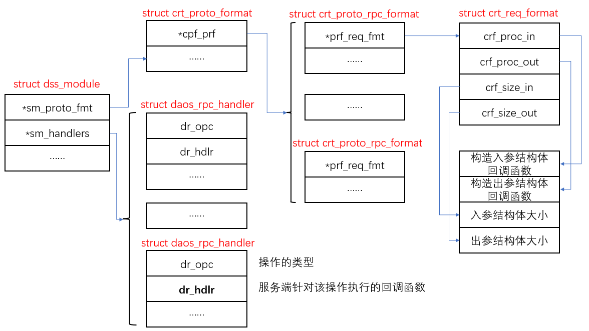

##### DAOS架构分析

DAOS系统的整体架构如下，主要包含三个进程：daos_agent、daos_server和daos_engine。


daos_agent：驻守客户端上的守护进程，与客户端进程中加载的libdaos库进行交互，主要对客户端进程进行身份验证和鉴权。*是不是可以理解为每个客户端服务器上都必须有一个daos_agent进程？*daos_agent和客户端进程之间使用dRPC交互。
daos_server：驻守服务侧的控制平面进程。解析配置文件、拉起daos_engine进程、转发命令和身份验证。
daos_engine：驻守服务侧的数据平面进程。存储的核心进程，管理本地存储，同时提供池和容器服务。


六大微服务：
`Management(管理)、Pool(池)、Container(容器)、Object(对象)、Rebuild(重构)、Security(鉴权)`

八大基础组件：

```
1、Communications(dRPC、gRPC & CART)：通信组件，不同模块使用不同的组件。同一台服务器上的不同进程间通信使用dRPC、控制面不同服务器上的进程通信使用gRPC、数据面不同服务器上的进程通信使用CART；
2、Logging, Debugging(libgurt)：日志和调试组件；
3、Algorithmic Placement(Ring based, jump consistent hash)：分布式算法；
4、Btrees, task engine(libdaos_common)：
5、Persistent Storage(VOS, BIO & VEA)：持久化存储；
6、Replication Framework(rsvc & rdb)：分布式框架；
7、Thread Model(daos_server, daos_engine, Argobots)：线程模型；
8、Offload/Accelerator()：
```


##### DSS_MODULE分析

数据面的服务daos_engine通过模块接口按需加载模块，每个模块都是一个动态库，daos_engine通过dlopen加载动态库，获取动态库支持的功能集(dss_module)。每个功能集应该有如下特性：

```
a、模块名；
b、模块的ID；
c、模块的功能掩码；
d、模块的初始化和去初始化函数；
可选一下功能：
e、启动和清除函数；
f、cart rpc句柄；
g、drpc句柄；
```

dss_module结构体形式如下：

```
struct dss_module
{
	const char	    *sm_name;		// 模块名，各模块自定义
	int				sm_mod_id;		// 模块ID, daos_module_id枚举值
	int				sm_ver;			// 模块的版本信息，各模块自维护
	uint64_t		sm_facs;		// 当前未使用
	
	// key of local thread storage
	struct dss_module_key		*sm_key;	
	
	// Initialization function, invoked just after successful load，加载模块后执行初始化动作
	int				(*sm_init)(void);	
    // Finalization function, invoked just before module unload，去初始化动作，卸载模块前使用
	int				(*sm_fini)(void);	
    // Setup function, invoked after starting progressing,
	int				(*sm_setup)(void);	
    // Cleanup function, invoked before stopping progressing
	int				(*sm_cleanup)(void);	
	
	// Whole list of RPC definition for request sent by nodes
	// 反序列化参数，针对不同的Op类型进行操作，生成对应的结构体(入参和出参)
	struct crt_proto_format		*sm_proto_fmt;	
    // The count of RPCs which are dedicated for client nodes only
	uint32_t					sm_cli_count;	
    // RPC handler of these RPC, last entry of the array must be empty
    // CART协议，注册支持的回调函数句柄集(Op对应的处理函数)
	struct daos_rpc_handler		*sm_handlers;	
    // dRPC handlers, for unix socket comm, last entry must be empty
    // dRPC协议，只有mgmt模块注册了该功能，其他模块未使用
	struct dss_drpc_handler		*sm_drpc_handlers;	

    // Different module operation
	struct dss_module_ops		*sm_mod_ops;		
    // Per-pool metrics (optional)
	struct dss_module_metrics	*sm_metrics;		
};
```

各模块初始化dss_module结构体，初始化后各模块支持的功能集就能通过该结构体体现。


具体分析object如下：

```
struct dss_module obj_module =  {
	.sm_name	= "obj",
	.sm_mod_id	= DAOS_OBJ_MODULE,			// 4
	.sm_ver		= DAOS_OBJ_VERSION,			// 7
	.sm_init	= obj_mod_init,				// 初始化
	.sm_fini	= obj_mod_fini,				// 去初始化
	.sm_proto_fmt	= &obj_proto_fmt,		// 协议输入输出参数整合成结构体
	.sm_cli_count	= OBJ_PROTO_CLI_COUNT,  // 支持的cart回调数量, 由宏 OBJ_PROTO_CLI_RPC_LIST 决定
	.sm_handlers	= obj_handlers,			// rpc回调句柄(cart)，通过宏 OBJ_PROTO_CLI_RPC_LIST 实现
	.sm_key		= &obj_module_key,
	.sm_mod_ops	= &ds_obj_mod_ops,
	.sm_metrics	= &obj_metrics,
};

#define OBJ_PROTO_CLI_RPC_LIST						\
	X(DAOS_OBJ_RPC_UPDATE,						\
		0, &CQF_obj_rw,						\
		ds_obj_rw_handler, NULL, "update")			\
	X(DAOS_OBJ_RPC_FETCH,						\
		0, &CQF_obj_rw,						\
		ds_obj_rw_handler, NULL, "fetch")			\
	X(DAOS_OBJ_DKEY_RPC_ENUMERATE,					\
		0, &CQF_obj_key_enum,					\
	。。。

DAOS_OBJ_RPC_UPDATE：指定了Op操作的类型；
    #define X(a, b, c, d, e, f) a,		// 定义宏, 只取第一个参数
    enum obj_rpc_opc {
        OBJ_PROTO_CLI_RPC_LIST			// 这里展开宏, 取第一个参数
        OBJ_PROTO_CLI_COUNT,			// 功能集的数量
        OBJ_PROTO_CLI_LAST = OBJ_PROTO_CLI_COUNT - 1,
    };
    #undef X
这里指定X宏的展开方式，来获取Op类型宏。DAOS_OBJ_RPC_UPDATE/DAOS_OBJ_RPC_FETCH等等。

CQF_obj_rw：struct crt_req_format类型的结构体，用来协助生成Op相关入参和出参结构体的生成。

ds_obj_rw_handler：Op对应的处理函数，收到Op时进行处理的回调函数。
```

主要关注宏`OBJ_PROTO_CLI_RPC_LIST`，他由一系列的宏 `X(a,b,c,d,e,f)` 组成，在不同的场合对宏 
`X(a,b,c,d,e,f)` 进行不同的解释，达到了不同的效果。


###### 模块的加载

1、全局的模块数组，最大允许64个模块，当前使用11个(DAOS_NR_MODULE);
`static struct dss_module	*dss_modules[DAOS_MAX_MODULE];`

2、进程daos_engine启动时加载模块

```
src/engine/init.c : main(...)
	|
	|--	src/engine/init.c : server_init(...)
		|
		|--	src/engine/init.c : modules_load(...)
			{
				// 服务启动没指定加载模块时，就加载全部的默认模块
				// sprintf(modules, "%s", MODULE_LIST); 在文件src/engine/init.c中的parse(...)函数中
				// #define MODULE_LIST	"vos,rdb,rsvc,security,mgmt,dtx,pool,cont,obj,rebuild"
				
				1、遍历modules中的每一个module，通过dss_module_load加载所有指定的模块
				src/engine/module.c : dss_module_load(...)
				{
					// 1、根据模块名，加载对应的动态库，获取对应的dss_module；
					// 2、在全局锁的保护下，讲新获取的模块对应的dss_module放在dss_modules数组中，同时加入模块链表中；
					D_MUTEX_LOCK(&loaded_mod_list_lock);
					d_list_add_tail(&lmod->lm_lk, &loaded_mod_list);	// 链表
					dss_modules[smod->sm_mod_id] = smod;				// 数组
					D_MUTEX_UNLOCK(&loaded_mod_list_lock);
				}
			}
		|
		|-- src/engine/init.c : dss_module_init_all(...)
			{
				1、遍历loaded_mod_list, 对链表中的每一个module进程初始化动作；	
				src/engine/module.c : dss_module_init_one(...)
				{
					1、获取模块支持的功能集
					smod = lmod->lm_dss_mod; 
					
					2、执行模块初始化函数
					rc = smod->sm_init();
					
					3、注册key，待详细分析
					dss_register_key(smod->sm_key);
					
					4、注册cart相关功能, src/include/daos/rpc.h
					daos_rpc_register(...);
					{
						1、遍历功能集，将Op对应的回调函数赋值给协议结构体(struct crt_proto_format)
						proto_fmt->cpf_prf[i].prf_hdlr = handlers[i].dr_hdlr;
						
						2、注册协议集到CART
						src/cart/crt_regist.c : crt_proto_register(struct crt_proto_format *cpf)
							|
							|-- crt_proto_register_common(...)
								|
								|-- crt_proto_reg_L1(crt_gdata.cg_opc_map, cpf)
								{
									1、根据cpf协议归属的模块找到模块的协议集列表(模块)
									L2_map = &map->com_map[index];
									crt_proto_reg_L2(L2_map, cpf);
									{
										1、根据cpf找到当前协议版本的协议集(版本)
										L3_map = get_L3_map(L2_map, cpf);
										rt_proto_reg_L3(L3_map, cpf);
										{
											1、遍历cpf中支持的功能集, 注册到CART中(Op)
											crt_opc_reg_internal(...);
											{
												crt_opc_reg(...)
												{
													将cpf的相关参数赋值到crt_gdata.cg_opc_map.com_map.L2_map.L3_map;
													// 待详细分析
												}
											}
										}
									}
								}
					}
					
					5、注册drpc的相关功能(只有mgmt使用)
					drpc_hdlr_register_all(...);
				}
			}
```

3、`crt_gdata`是进程内部管理CART的一个全局结构体，其内部参数 `cg_opc_map` 存储不同模块的全部协议集，使用三级索引管理协议。
一级索引找到不同的服务(pool/obj/contain/...)，二级索引找服务不同版本的协议(v1/v2/...)，三级索引找到不同的Op。


###### 模块如何关联CART

1、Argobots简介：一个轻量级的线程、协程和任务调度框架。


xstream(execution stream)：代表一个线程，在线程上顺序调度运行协程(ULT)和任务(Tasklet)；xtream的状态切换如下图：


scheduler：调度器，默认是先入先出，一个调度器绑定一个线程；
ULT：协程，可以挂起让出CPU，运行状态如下图：


Tasklet：任务，不可分割的执行单元，没有自己的堆栈，无法让出CPU，运行状态如下图：


2、注册key，关联线程变量 `dss_tls_key`。协程初始化，指定协程的执行函数：

```
// 全局变量, 存储进程所有注册的dss_module_key, 当前默认大小为10
struct dss_module_key *dss_module_keys[DAOS_MODULE_KEYS_NR] = { NULL };

// 不同模块的key
dtx_srv.c (src\dtx) line 52 : struct dss_module_key dtx_module_key = {
srv.c (src\container) line 133 : struct dss_module_key cont_module_key = {
srv.c (src\engine) line 1016 : struct dss_module_key daos_srv_modkey = {
srv.c (src\pool) line 157 : struct dss_module_key pool_module_key = {
srv.c (src\rebuild) line 2243 : struct dss_module_key rebuild_module_key = {
srv_mod.c (src\object) line 180 : struct dss_module_key obj_module_key = {
vos_common.c (src\vos) line 426 : struct dss_module_key vos_module_key = {

src/engine/init.c : main(...)
  |
  |- src/engine/init.c : server_init(...)
    |
    // 注册key
    |- dss_module_init_all(...)
    {
    	1、daos全局的模块信息注册
    	src/engine/tls.c : dss_register_key(&daos_srv_modkey);
    	
    	2、针对每一个模块进行初始化动作
    	dss_module_init_one()
    	{
    		src/engine/tls.c : dss_register_key(smod->sm_key);		// 注册各个模块的key
    		{
    			D_MUTEX_LOCK(&dss_module_keys_lock);
				for (i = 0; i < DAOS_MODULE_KEYS_NR; i++) {	// 数组范围内
					if (dss_module_keys[i] == NULL) {
						dss_module_keys[i] = key;   // key放在全局的数组中
						key->dmk_index = i;			// 将在全局数组中的位置记录到key的dmk_index中, 便于反向查找
						break;
					}
				}
				D_MUTEX_UNLOCK(&dss_module_keys_lock);
    		}
    	}
    }
    |
    // 协程初始化，指定协程的执行函数
	|- src/engine/srv.c : dss_srv_init(...)
	  |
	  |- dss_xstreams_init(...)
	    |
	    |- dss_start_xs_id(...)
	      |
	      |- dss_start_one_xstream(hwloc_cpuset_t cpus, int xs_id)		// 创建一个xtream线程 
	      {
			。。。
			// 创建一个网络池上的ULT协程，协程的执行函数为：dss_srv_handler
			ABT_thread_create(dx->dx_pools[DSS_POOL_NET_POLL],dss_srv_handler, dx, attr,&dx->dx_progress);
			。。。
	      }
```

3、协程回调处理函数

```
src/engine/srv.c : dss_srv_handle(void *arg)
{
	// 初始化线程变量, 线程id: dx_xs_id, 为线程dx_xs_id初始化线程变量
	dtc = dss_tls_init(DAOS_SERVER_TAG, dx->dx_xs_id, dx->dx_tgt_id);
	
	// 获取daos的module_info
	dmi = dss_get_module_info();
	
	// 创建cart句柄(通信交互)
	rc = crt_context_create(&dmi->dmi_ctx);
	  |
	  |- src/cart/crt_context.c : crt_context_create(crt_context_t *crt_ctx)
	  	|
		|- crt_context_provider_create(crt_context_t *crt_ctx, int provider)
		  |
		  |- src/cart/crt_hg.c : crt_hg_ctx_init(struct crt_hg_context *hg_ctx, int provider, int idx)
		  	|
			|- crt_hg_class_init(int provider, int idx, hg_class_t **ret_hg_class)
			  |
			  |- crt_hg_reg_rpcid(hg_class_t *hg_class)
			  {
			     	rc = crt_hg_reg(hg_class, CRT_HG_RPCID,
                            (crt_proc_cb_t)crt_proc_in_common,         // 入参整合成对应的结构体
                            (crt_proc_cb_t)crt_proc_out_common,        // 出参整合成对应的结构体
                            (crt_hg_rpc_cb_t)crt_rpc_handler_common);  // Op对应的处理函数
                            
                    rc = HG_Registered_disable_response(hg_class, CRT_HG_ONEWAY_RPCID, HG_TRUE);
			  }
	
	// 注册回调
    crt_context_register_rpc_task(dmi->dmi_ctx, dss_rpc_hdlr, dss_iv_resp_hdlr, dx);
}

// 入参整合处理函数
src/cart/crt_hg_proc.c : crt_proc_in_common(crt_proc_t proc, crt_rpc_input_t *data)
	|
	|-- crt_proc_input(struct crt_rpc_priv *rpc_priv, crt_proc_t proc)
	{
		// 注册的Op处理结构体
		struct crt_req_format *crf = rpc_priv->crp_opc_info->coi_crf;

		// 消息对应的入参回调处理
		return crf->crf_proc_in(proc, rpc_priv->crp_pub.cr_input);
	}
	
// 出参整合处理函数
src/cart/crt_hg_proc.c : crt_proc_out_common(crt_proc_t proc, crt_rpc_output_t *data)
	|
	|-- crt_proc_output(struct crt_rpc_priv *rpc_priv, crt_proc_t proc)
	{
		// 注册的Op处理结构体
		struct crt_req_format *crf = rpc_priv->crp_opc_info->coi_crf;

		// 消息对应的出参回调处理
		return crf->crf_proc_out(proc, rpc_priv->crp_pub.cr_output);
	}
	
// cart协议Op接收后回调处理函数入口
src/cart/crt_hg.c : crt_rpc_handler_common(hg_handle_t hg_hdl)
{
	// 解析出消息类型
	rc = crt_hg_unpack_header(hg_hdl, &rpc_tmp, &proc);	
    
    // 从初始化注册的表中找到Op对应的结构：struct crt_opc_info
    opc_info = crt_opc_lookup(crt_gdata.cg_opc_map, opc, CRT_UNLOCK);
    
    // Op关联的操作赋值到结构体：crt_rpc_priv
    rpc_priv->crp_opc_info = opc_info;
    
    src/cart/crt_rpc.c : crt_rpc_common_hdlr(struct crt_rpc_priv *rpc_priv)
   		|
   		|-- src/engine/srv.c : dss_rpc_hdlr(...)
   			|
			|-- src/cart/crt_rpc.c : crt_handle_rpc(void *arg)
			{
				// 执行Op注册的回调函数
				rpc_priv->crp_opc_info->coi_rpc_cb(rpc_pub);	
			}
}
```

##### 客户端IO流程分析

###### 与ceph的类比

pool：类似于ceph中的节电池；
container：类似于ceph中的硬盘池；
object：类似于ceph中的逻辑池，关联分布策略(副本/纠删码)；
Dkey：类似于ceph中的对象；
Akey：类似于ceph中对象的属性信息(attrs/omap)；
group：类似于ceph中的pg；
target：类似于ceph中的osd；


